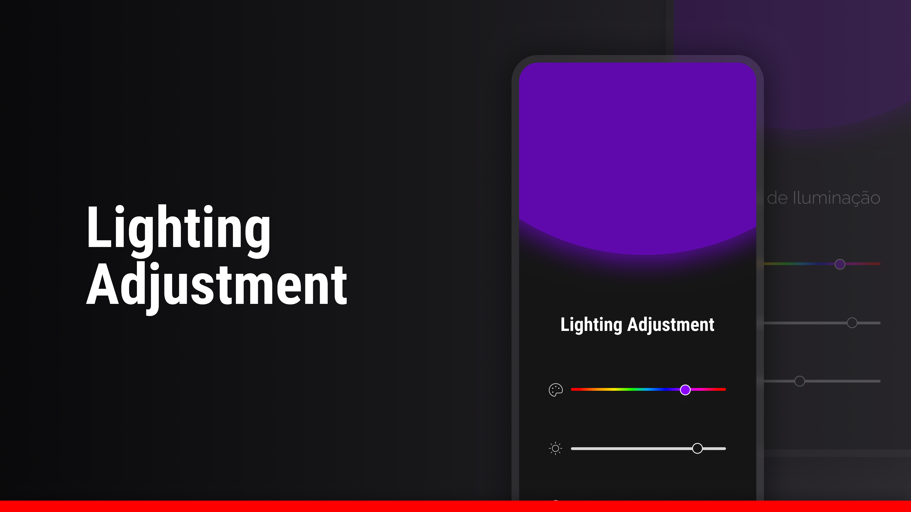

## The Project 
Lighting Adjustment is a web-responsive tool, in which a user can manipulate lightning components, such as color palette, brightness, and contrast.

The project was created for #boraCodar, an online developer community created by Rocketseat Technology School, in which developers can put into practice their coding skills and solve the exercises.

## Technologies
The technologies used were:
- HTML;
- CSS;
- JavaScript;
- Figma;
- Git and GitHub.

## Layout
You can see the project's layout at [link](https://www.figma.com/file/bArJLNwb73nngpK19dZApZ/Ajustes-de-Ilumina%C3%A7%C3%A3o-%E2%80%A2-Desafio-24-(Community)-(Copy)?type=design&node-id=0-1&mode=design&t=U5N8oxGUx4nwCAfL-0). 
A [Figma](https://www.figma.com) account is required.